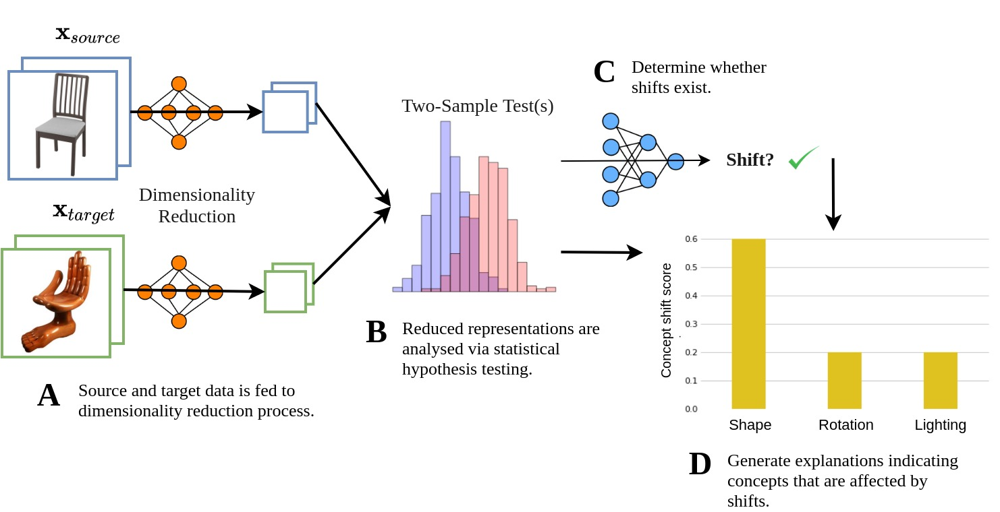

# Failing Conceptually: Concept-Based Explanations of Dataset Shift

[](https://opensource.org/licenses/MIT)
[](https://www.python.org/downloads/release/python-360/)


## Description
Despite their remarkable performance on a wide range of visual tasks, machine learning technologies often succumb to data distribution shifts. Consequently, a range of recent work explores techniques for detecting these shifts. Unfortunately, current techniques offer no explanations about what triggers the detection of shifts, thus limiting their utility to provide actionable insights. In this work, we present **C**oncept **B**ottleneck **S**hift **D**etection (CBSD): a novel explainable shift detection method. CBSD provides explanations by identifying and ranking the degree to which high-level human-understandable concepts are affected by shifts. Using two case studies (*dSprites* and *3dshapes*), we demonstrate how CBSD can accurately detect underlying concepts that are affected by shifts and achieve higher detection accuracy compared to state-of-the-art shift detection methods.

This repository contains source code of the system and experimentation results.

**Note**:
- Core related work include [Lipton, Wang, and Smola (2020)](https://arxiv.org/pdf/1802.03916.pdf), [Koh et al. (2020)](https://arxiv.org/pdf/2007.04612.pdf), [Rabanser, Gunnemann, and Lipton (2019)](https://arxiv.org/pdf/1810.11953.pdf), [Kazhdan et al. (2020)](https://arxiv.org/pdf/2010.13233.pdf).

## Pipeline



Our shift detection pipeline comprises four step:
<ol type="A">
  <li>The source and target data are fed to a dimensionality reduction process.</li>
  <li>The reduced representations are analysed using two-sample hypothesis testing, producing <i>p</i>-value and test statistics.</li>
  <li>The resulting <i>p</i>-value and test statistics are used to determine whether a shift exist. We determine a shift exists when there are statistically significant difference in distribution between source and target data. </li>
  <li>CBSD provides explanations, identifying and ranking the degree to which each human-understandable concepts were affected by shifts.</li>
</ol>

## Requirements:
- Python 3.6+
- numpy
- pandas
- matplotlib
- jupyter
- scipy
- scikit-learn
- TensorFlow 2
- torch
- h5py
- plotly

## Folder Structure:
- ```data```: contains datasets used for experimentation.
- ```experiments```: contains notebooks that we used to run experiments and visualise results.  
   - ```dSprites```: experimentation codes to generate data and visualise results of dSprites.
   - ```smallnorb```: experimentation codes to generate data and visualise results of smallnorb.
   - ```3dshapes```: experimentation codes to generate data and visualise results of 3dshapes.
- ```results```: contains pickled experimentation results.
- ```models```: contains pretrained neural network models.
- ```scripts```: the source codes and utility functions written fully in Python.

## Setup:
```bash
git clone https://github.com/maleakhiw/explaining-dataset-shifts.git
cd explaining-dataset-shifts
pip install -r requirements.txt
```

## Authors:
- Maleakhi A. Wijaya (maw219@cam.ac.uk)
- Dmitry Kazhdan (dk525@cam.ac.uk)
- Botty Dimanov (btd26@cam.ac.uk) 
- Mateja Jamnik (mateja.jamnik@cl.cam.ac.uk)
